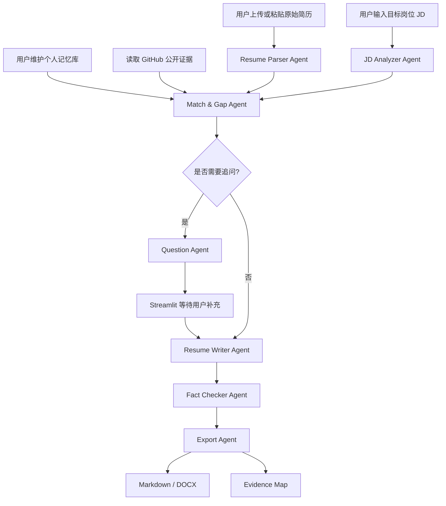

# 简历定制 Agent

一个基于 LangGraph 的本地简历定制 Agent。用户上传或粘贴原始简历，并输入目标岗位 JD 后，系统会自动完成岗位分析、简历解析、匹配缺口诊断、human-in-the-loop 追问、定制简历生成、事实校验和 Markdown / DOCX 导出。

项目重点不是简单润色简历，而是通过结构化输出和 evidence map 事实来源映射，尽量避免把 JD 要求或模型推测写成候选人的真实经历。

## 功能列表

- 支持上传 PDF / DOCX / TXT 简历。
- 支持直接粘贴简历文本。
- 自动分析目标岗位 JD，提取职责、必备技能、加分技能、关键词和招聘方关注点。
- 自动解析候选人基本信息、教育背景、工作经历、项目经历、技能、证书和成果。
- 支持个人记忆库，用于补充原始简历没有写出的真实经历、技能、项目事实和表达偏好。
- 支持读取 GitHub 公开信息，提取公开仓库、语言、主题、README 摘要等可用证据。
- 对比 JD 与简历，输出匹配优势和缺失信息。
- 根据缺口生成最多 5 个具体追问问题。
- 支持多轮追问：用户回答后可继续追问，回答会沉淀到本轮记忆中，直到信息足够或用户选择立即生成。
- 支持用户回答“没有 / 不清楚 / 跳过”，避免诱导编造经历。
- 基于原始简历和用户补充信息生成定制化简历。
- 使用 Fact Checker Agent 检查关键内容来源。
- 输出事实来源映射表 evidence map。
- 支持下载 Markdown 和 DOCX。
- 未配置 OpenAI API Key 时提供基础规则兜底，方便演示流程。

## 技术栈

- Python 3.10+
- Streamlit
- LangGraph
- OpenAI API
- Pydantic
- pdfplumber
- python-docx
- python-dotenv
- Markdown

## Agent 架构

项目将流程拆分为多个 Agent 节点：

| Agent | 职责 |
|---|---|
| Resume Parser Agent | 读取简历文本，提取候选人结构化信息，并保留原文证据 |
| JD Analyzer Agent | 分析岗位 JD，提取职责、技能、关键词和招聘方关注点 |
| Match & Gap Agent | 对比简历、个人记忆、GitHub 证据与 JD，识别匹配优势和缺失信息 |
| Question Agent | 根据缺口生成具体追问问题 |
| Resume Writer Agent | 基于原始简历和用户补充信息生成定制简历 |
| Fact Checker Agent | 校验最终简历中的关键内容是否有来源 |
| Export Agent | 导出 Markdown 和 DOCX |

LangGraph 负责编排状态流转，Streamlit 负责用户界面和 human-in-the-loop 输入。

## 工作流程



## 安装方法

建议使用虚拟环境：

```bash
python -m venv .venv
.venv\Scripts\activate
pip install -r requirements.txt
```

macOS / Linux 可使用：

```bash
python -m venv .venv
source .venv/bin/activate
pip install -r requirements.txt
```

## 运行方法

复制环境变量示例文件：

```bash
copy .env.example .env
```

macOS / Linux 可使用：

```bash
cp .env.example .env
```

编辑 `.env`：

```bash
OPENAI_API_KEY=your_api_key_here
OPENAI_MODEL=gpt-4.1-mini
OPENAI_BASE_URL=
OPENAI_ENABLE_DEMO_FALLBACK=true
APP_PASSWORD=
```

启动应用：

```bash
streamlit run app.py
```

如果暂时没有 OpenAI API Key，可以保留：

```bash
OPENAI_ENABLE_DEMO_FALLBACK=true
```

此时系统会使用基础规则兜底，适合演示页面流程；配置 API Key 后，岗位分析、追问和简历生成质量会更高。

## 环境变量

| 变量 | 必填 | 说明 |
|---|---|---|
| OPENAI_API_KEY | 推荐 | OpenAI API Key。未配置时可用规则兜底演示 |
| OPENAI_MODEL | 否 | 默认 `gpt-4.1-mini` |
| OPENAI_BASE_URL | 否 | 第三方 OpenAI 兼容中转站地址，例如 `https://example.com/v1` |
| OPENAI_ENABLE_DEMO_FALLBACK | 否 | 是否启用无 Key 或调用失败时的规则兜底 |
| APP_PASSWORD | 否 | 访问密码。为空时不启用密码；部署到公网时建议设置 |

不要把真实 API Key 提交到代码仓库或打包进公开 ZIP。

### 使用第三方中转站

如果使用 OpenAI 兼容中转站，可以在 `.env` 中填写：

```bash
OPENAI_API_KEY=你的中转站密钥
OPENAI_BASE_URL=https://你的中转站域名/v1
OPENAI_MODEL=中转站提供的模型ID
OPENAI_ENABLE_DEMO_FALLBACK=true
APP_PASSWORD=你设置的访问密码
```

模型 ID 需要以中转站后台或文档为准。项目会先尝试 Responses API 结构化输出；如果中转站不支持 Responses API，会自动回退到 Chat Completions 的 JSON 输出。

## 无银行卡部署：Streamlit Community Cloud

如果没有银行卡，推荐使用 Streamlit Community Cloud。它适合 Streamlit 项目，支持从 GitHub 仓库部署，也支持在部署页面填写 Secrets，不需要把 API Key 提交到仓库。

官方文档说明 Community Cloud 可以免费创建、部署和管理 Streamlit app，并且部署时可以在 Secrets 字段粘贴 `secrets.toml` 内容。

### 部署步骤

1. 打开 Streamlit Community Cloud：

```text
https://share.streamlit.io/
```

2. 使用 GitHub 登录。

3. 点击：

```text
Create app
```

4. 选择：

```text
Yup, I have an app
```

5. 填写仓库信息：

```text
Repository: IHanabiI/resume-agent-portfolio
Branch: main
Main file path: app.py
```

6. 在 Advanced settings / Secrets 中粘贴：

同时在 Advanced settings 中选择 Python 版本：

```text
Python version: 3.12
```

Streamlit Community Cloud 不使用 `runtime.txt` 设置 Python 版本。Python 版本需要在创建 app 时选择；如果 app 已经创建，必须删除后重新部署才能更换 Python 版本。

7. 在 Advanced settings / Secrets 中粘贴：

```toml
OPENAI_API_KEY = "你的中转站密钥"
OPENAI_BASE_URL = "https://www.fluapi.com/v1"
OPENAI_MODEL = "gpt-5.5"
OPENAI_ENABLE_DEMO_FALLBACK = "true"
APP_PASSWORD = "Wth147258369"
```

8. 点击 Deploy。

部署完成后会得到一个类似下面的地址：

```text
https://你的应用名.streamlit.app
```

访问时输入：

```text
Wth147258369
```

即可进入项目。

### Secrets 模板

仓库里提供了模板：

```text
.streamlit/secrets.example.toml
```

不要提交真实的：

```text
.streamlit/secrets.toml
```

它已经被 `.gitignore` 排除。

## 可选部署：Render

本项目已经包含 `render.yaml`，适合从 GitHub 仓库快速部署到 Render。

注意：如果 Render Workspace 要求绑定银行卡，可以跳过 Render，直接使用上面的 Streamlit Community Cloud 方案。

### 适合场景

- 求职展示。
- 发给面试官一个在线体验链接。
- 部署者只需要填写自己的 URL、Key 和模型名。
- 不希望项目被太多人随意使用。

### 部署步骤

1. 把项目上传到 GitHub。

2. 确认仓库中不要包含 `.env`。

3. 打开 Render Blueprint 创建页面：

```text
https://dashboard.render.com/blueprint/new
```

4. 选择你的 GitHub 仓库。

5. Render 会读取仓库里的 `render.yaml`。

6. 在 Render 的环境变量页面填写这些变量：

```text
OPENAI_API_KEY=你的中转站密钥
OPENAI_BASE_URL=https://你的中转站域名/v1
OPENAI_MODEL=gpt-5.5
APP_PASSWORD=你给面试官的访问密码
```

其中 `OPENAI_API_KEY`、`OPENAI_BASE_URL` 和 `APP_PASSWORD` 在 `render.yaml` 中使用了 `sync: false`，不会写死在仓库里。

7. 点击 Apply / Deploy。

8. 部署完成后，Render 会提供一个公网访问地址，例如：

```text
https://resume-agent-xxxx.onrender.com
```

访问时输入 `APP_PASSWORD` 即可进入项目。

### Render 启动命令

`render.yaml` 中已经配置：

```bash
streamlit run app.py --server.address 0.0.0.0 --server.port $PORT --server.headless true
```

Render 会通过 `$PORT` 注入服务端口，因此不要把端口固定写死为 `8501`。

### 推荐求职展示方式

你可以给面试官发送：

```text
在线体验：https://你的-render-url.onrender.com
访问密码：你设置的 APP_PASSWORD
GitHub 仓库：https://github.com/你的用户名/resume-agent

说明：该项目支持 OpenAI 兼容中转站，部署时只需填写 OPENAI_BASE_URL、OPENAI_API_KEY 和 OPENAI_MODEL。
```

如果担心访问量消耗额度，可以临时打开 Render 服务，面试结束后暂停服务或更换 `APP_PASSWORD`。

## 示例使用流程

1. 启动应用：`streamlit run app.py`。
2. 在“个人记忆库”中填写原始简历没有写出的真实经历、项目细节、技能、成果数据和表达偏好。
3. 在“GitHub 证据”中输入 GitHub 用户名或仓库链接，点击“读取 GitHub 公开信息”。
4. 打开 `sample_data/sample_resume.txt`，复制到简历文本框。
5. 打开 `sample_data/sample_job_description.txt`，复制到 JD 文本框。
6. 点击“开始分析”。
7. 查看岗位分析、候选人解析、匹配优势、缺失信息和追问问题。
8. 根据真实情况回答问题，也可以填写“没有 / 不清楚 / 跳过”。
9. 如果回答后仍有信息可挖掘，点击“继续追问并更新记忆”。系统会把有效回答追加到本轮记忆库，并重新生成下一轮追问。
10. 如果信息已经足够，或你想马上看结果，点击“立刻生成定制简历”。当前轮有效回答也会先写入本轮记忆，再参与简历生成。
11. 查看定制简历、优化说明和事实来源映射表。
12. 下载 `tailored_resume.md` 和 `tailored_resume.docx`。

## 个人记忆库

只靠一份原始简历和 JD，Agent 很难知道用户实际做过哪些项目、有哪些能力、哪些经历没有写出来。因此项目增加了个人记忆库。

你可以在记忆库中记录：

- 原始简历没有写全的项目经历。
- 具体负责内容、技术栈、难点和成果。
- 熟悉但简历没有写的工具、框架和工作流。
- 可确认的数据，例如处理规模、交付周期、节省时间、用户数。
- 不希望写入简历的内容或表达偏好。

记忆库可以下载为 `user_memory.json`，下次使用时再导入。当前版本不依赖数据库，适合自用和作品展示。

导出的记忆库 JSON 会包含：

- 手动填写的个人记忆。
- 多轮追问中的问题和有效回答。
- 与问题相关的 JD 要求。
- GitHub 公开证据摘要。

因此即使没有历史记录，下次重新进入网页后，只要导入 `user_memory.json`，Agent 就能复用之前已经回答过的信息，避免重复追问类似问题。

### 多轮追问如何工作

很多使用者并不会主动想到所有可写进简历的信息，因此系统支持多轮追问：

1. 系统根据 JD、原始简历、记忆库和 GitHub 证据提出第一轮问题。
2. 用户回答后，可以点击“继续追问并更新记忆”。
3. 系统会把有效回答追加到本轮记忆库，并在导出记忆库 JSON 时结构化保存。
4. 系统重新进行匹配与缺口分析，并生成下一轮更具体的问题。
5. 用户可以重复这个过程，直到觉得信息足够。
6. 用户也可以随时点击“立刻生成定制简历”。

回答“没有 / 不清楚 / 跳过”的内容不会进入正式简历正文，也不会被强行写成能力。

## GitHub 公开证据

在“GitHub 证据”区域输入 GitHub 用户名或仓库链接，例如：

```text
IHanabiI
https://github.com/IHanabiI/resume-agent-portfolio
```

系统会尝试读取公开仓库信息，包括：

- 仓库名称和链接。
- 仓库描述。
- 主要语言。
- topics。
- README 摘要。
- 最近更新的公开仓库。

这些信息会作为 `github` 类型证据进入 Agent 工作流。Agent 可以参考这些证据生成追问和简历内容，但仍然不能把没有来源的信息写入正式简历。

## 防虚构机制

项目使用三层机制降低幻觉风险：

1. Prompt 约束  
   所有 Agent 提示词都要求只使用原始简历、个人记忆库、GitHub 公开证据、用户回答或用户确认的信息。

2. Human-in-the-loop 追问  
   当 JD 要求没有在简历、记忆库或 GitHub 证据中出现时，系统只会追问，不会直接写入最终简历。

3. Evidence Map  
   最终简历会输出事实来源映射表。每条关键内容需要标明来源类型、来源文本和状态。

防虚构规则包括：

- 不编造公司、岗位、项目、学历、证书、奖项、技能、数据、成果、时间线。
- 不把 JD 要求直接写成候选人能力。
- 用户只说“了解”，不能写成“熟练”或“精通”。
- 用户只说“参与”，不能写成“负责”或“主导”。
- 没有量化数据时，不自动添加百分比、金额、人数、增长率或效率提升幅度。
- 用户回答“没有 / 不清楚 / 跳过”的内容不能进入正式简历正文。

## 文件导出

生成结果会保存到 `outputs/`：

- `tailored_resume.md`
- `tailored_resume.docx`

页面中也提供下载按钮，可以直接下载 Markdown 和 DOCX。

## 项目结构

```text
resume-agent/
├── app.py
├── README.md
├── requirements.txt
├── render.yaml
├── .env.example
├── .gitignore
├── sample_data/
│   ├── sample_resume.txt
│   └── sample_job_description.txt
├── src/
│   ├── config.py
│   ├── file_parser.py
│   ├── schemas.py
│   ├── llm_client.py
│   ├── agents/
│   ├── exporter/
│   ├── graph/
│   └── prompts/
├── outputs/
└── screenshots/
```

## 截图占位

`screenshots/` 目录用于存放作品展示截图。建议补充：

- `demo_screenshot_1.png`：输入材料与分析结果。
- `demo_screenshot_2.png`：定制简历与 evidence map。

## 后续可扩展方向

- 增加更多简历模板和版式。
- 增加 PDF 导出。
- 增加 ATS 关键词覆盖率评分。
- 增加多版本生成，例如保守版、技术强化版、业务成果版。
- 增加 LangGraph checkpoint，用于恢复中断流程。
- 将 Resume Writer、Fact Checker、Career Coach 扩展为 CrewAI 多 Agent 协作审阅流程。
